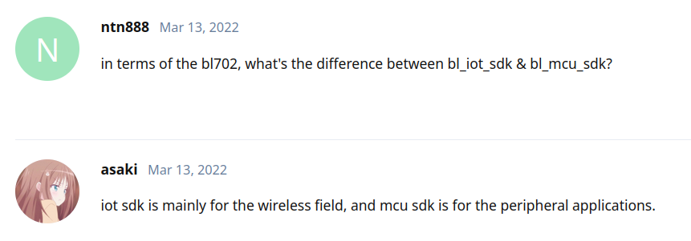
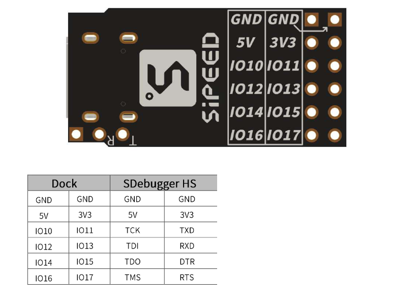
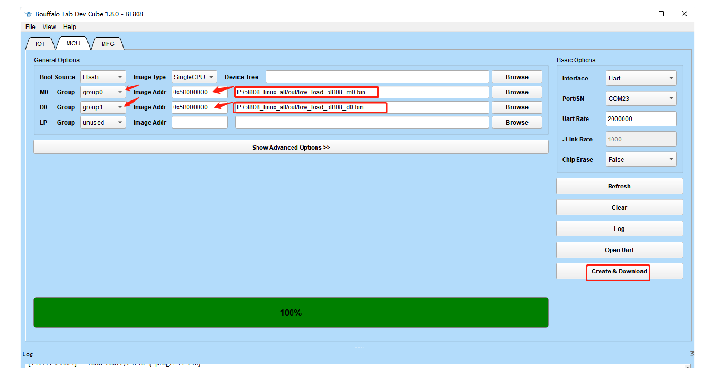
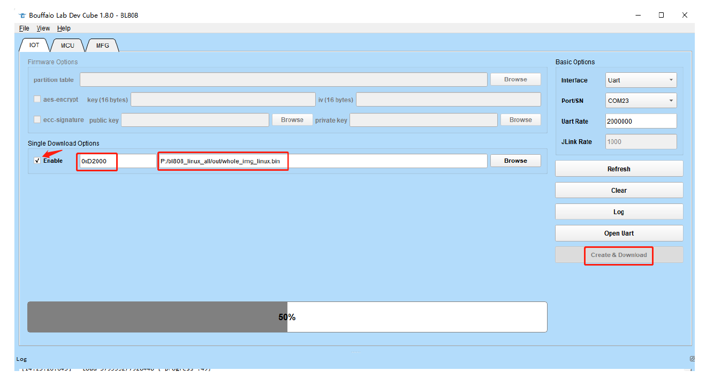

# Opensource toolchain for series RISC-V based MCU from Bouffalo Lab

Bouffalo Lab Intelligent Technology (Nanjing) Co., Ltd. was established in Nanjing in 2016. It is a company focusing on the research and development of world-leading ultra-low power consumption, intelligent Internet of Things and edge computing SoCs, as well as providing overall solutions for intelligent cloud platforms. enterprise. At the same time, the company has complete multi-mode wireless connection technology, audio and video processing and artificial intelligence algorithm technology, which can fully realize the chip research and development of single-chip integration.

In short, this company produce a series RISC-V based MCU which focused on Wi-Fi, BT, BLE, Zigbee, includes:

- BL602 series, Wi-Fi/BLE
- BL702 series, BLE/Zigbee
- BL606 series, Wi-Fi/BT/BLE/Zigbee/Ethernet/USB2.0 six-in-one 
- BL616 series, Wi-FI/BT5
- BL808 series, 3 cores + 1 npu
  + T-HEAD C906 RV64GCV 480MHz (D0)
  + T-HEAD E907 RV32GCP 320MHz (M0)
  + T-HEAD E902 RV32EMC 160MHz (LP) , my work to enable LP core already upstreamed.
  + BLAI-100

All datasheets and user manuals can be found in [bl_docs](https://github.com/bouffalolab/bl_docs) repo.

This tutorial will try best to cover all these chips.

# Table of contents
- [Hardware prerequist](https://github.com/cjacker/opensource-toolchain-bouffalo-lab/blob/main/README.md#hardware-prerequist)
- [Toolchain overview](https://github.com/cjacker/opensource-toolchain-bouffalo-lab/blob/main/README.md#toolchain-overview)
- [Compiler](https://github.com/cjacker/opensource-toolchain-bouffalo-lab/blob/main/README.md#compiler)
  + [For bl_mcu_sdk](https://github.com/cjacker/opensource-toolchain-bouffalo-lab/blob/main/README.md#for-bl_mcu_sdk)
    - [T-Head RISC-V embeded gnu toolchain](https://github.com/cjacker/opensource-toolchain-bouffalo-lab/blob/main/README.md#t-head-xuantie-risc-v-embeded-gcc)
    - [T-Head RISC-V Linux toolchain](https://github.com/cjacker/opensource-toolchain-bouffalo-lab/blob/main/README.md#t-head-xuantie-risc-v-linux-gcc-optional)
  + [For bl_iot_sdk](https://github.com/cjacker/opensource-toolchain-bouffalo-lab/blob/main/README.md#for-bl_iot_sdk)
- [SDK](https://github.com/cjacker/opensource-toolchain-bouffalo-lab/blob/main/README.md#sdk)
  + [bl_mcu_sdk](https://github.com/cjacker/opensource-toolchain-bouffalo-lab/blob/main/README.md#bl_mcu_sdk)
    - [sdk installation](https://github.com/cjacker/opensource-toolchain-bouffalo-lab/blob/main/README.md#sdk-installation)
    - [demo projects](https://github.com/cjacker/opensource-toolchain-bouffalo-lab/blob/main/README.md#demo-project)
  + [M1s_BL808_SDK](https://github.com/cjacker/opensource-toolchain-bouffalo-lab/blob/main/README.md#m1s_bl808_sdk)
  + [bl_iot_sdk](https://github.com/cjacker/opensource-toolchain-bouffalo-lab/blob/main/README.md#bl_iot_sdk)
- [Programming](https://github.com/cjacker/opensource-toolchain-bouffalo-lab/blob/main/README.md#programming)
  + [programming tools installation](https://github.com/cjacker/opensource-toolchain-bouffalo-lab/blob/main/README.md#programming-tools-installation)
  + [programming](https://github.com/cjacker/opensource-toolchain-bouffalo-lab/blob/main/README.md#programming-1)
    - [for bl_mcu_sdk](https://github.com/cjacker/opensource-toolchain-bouffalo-lab/blob/main/README.md#for-bl_mcu_sdk-1)
    - [for M1s_BL808_SDK](https://github.com/cjacker/opensource-toolchain-bouffalo-lab/blob/main/README.md#for-m1s_bl808_sdk)
      + [To program on-board BL702 of M1S Dock](https://github.com/cjacker/opensource-toolchain-bouffalo-lab/blob/main/README.md#to-program-on-board-bl702-of-m1s-dock)
      + [To program E907 core of BL808 for M1S Dock](https://github.com/cjacker/opensource-toolchain-bouffalo-lab/blob/main/README.md#to-program-e907-core-of-bl808-for-m1s-dock)
      + [To program C906 core of BL808 for M1S Dock](https://github.com/cjacker/opensource-toolchain-bouffalo-lab/blob/main/README.md#to-program-c906-core-of-bl808-for-m1s-dock)
        - [Option 1 : with U-Disk mode (M1S Specific)](https://github.com/cjacker/opensource-toolchain-bouffalo-lab/blob/main/README.md#option-1--with-u-disk-mode-m1s-specific)
        - [Option 2 : with bflb-iot-tool from commandline](https://github.com/cjacker/opensource-toolchain-bouffalo-lab/blob/main/README.md#option-2--with-bflb-iot-tool-from-commandline)
    - [for bl_iot_sdk](https://github.com/cjacker/opensource-toolchain-bouffalo-lab/blob/main/README.md#for-bl_iot_sdk-1)
- [Debugging](https://github.com/cjacker/opensource-toolchain-bouffalo-lab/blob/main/README.md#debugging)
  + [With OpenOCD and JTAG debugger](https://github.com/cjacker/opensource-toolchain-bouffalo-lab/blob/main/README.md#with-openocd-and-jtag-debugger)
  + [With C-Sky debug server and CK-Link Lite](https://github.com/cjacker/opensource-toolchain-bouffalo-lab/blob/main/README.md#with-c-sky-debug-server-and-ck-link-lite)
    - [Install C-Sky Debug Server](https://github.com/cjacker/opensource-toolchain-bouffalo-lab/blob/main/README.md#install-c-sky-debug-server)
    - [Option 1 : Use T-Head / HLK CK-Link Lite Debugger](https://github.com/cjacker/opensource-toolchain-bouffalo-lab/blob/main/README.md#option-1--use-t-head-or-hlk-ck-link-debugger)
    - [Option 2 : Use Sipeed RV Debugger Plus or M0S Dock with cklink-lite firmware](https://github.com/cjacker/opensource-toolchain-bouffalo-lab/blob/main/README.md#option-2--use-sipeed-rv-debugger-plus-or-m0s-dock-with-cklink-lite-firmware)
    - [Option 3 : Make your own CK-Link Lite debugger with STM32F103](https://github.com/cjacker/opensource-toolchain-w80x#option-3--make-your-own-ck-link-lite-debugger-with-stm32f103)
    - [Launch C-Sky debug server](https://github.com/cjacker/opensource-toolchain-bouffalo-lab/blob/main/README.md#launch-c-sky-debug-server)
    - [Debugging](https://github.com/cjacker/opensource-toolchain-bouffalo-lab/blob/main/README.md#debugging-1)
- [Build and run openbouffalo Linux Image for BL808 CPU](https://github.com/cjacker/opensource-toolchain-bouffalo-lab/blob/main/README.md#build-and-run-openbouffalo-linux-image-for-bl808-cpu)
  + [Build OpenBouffalo Linux Image](https://github.com/cjacker/opensource-toolchain-bouffalo-lab/blob/main/README.md#build-openbouffalo-linux-image)
  + [Program with bflb-iot-tool and flash a SD Card](https://github.com/cjacker/opensource-toolchain-bouffalo-lab/blob/main/README.md#program-with-bflb-iot-tool-and-flash-a-sd-card)
  + [Program with BLDevCube and flash a SD Card](https://github.com/cjacker/opensource-toolchain-bouffalo-lab/blob/main/README.md#program-with-bldevcube-and-flash-a-sd-card)
  + [Run OpenBouffalo Linux](https://github.com/cjacker/opensource-toolchain-bouffalo-lab/blob/main/README.md#run-openbouffalo-linux)
 
- [Miscellaneous](https://github.com/cjacker/opensource-toolchain-bouffalo-lab/blob/main/README.md#misc)
  + [Use Sipeed RV Debugger Plus as JTAG or CK-Link Lite debugger](https://github.com/cjacker/opensource-toolchain-bouffalo-lab/blob/main/README.md#how-to-build-and-program-uartjtag-and-dualuart-firmware-for-sipeed-rv-debugger-plus)
  + [Use M0S Dock as CK-Link Lite debugger](https://github.com/cjacker/opensource-toolchain-bouffalo-lab/blob/main/README.md#how-to-turn-m0s-dock-to-ck-link-lite)
  + [Sipeed M0sense programming notes](https://github.com/cjacker/opensource-toolchain-bouffalo-lab/blob/main/README.md#m0sense-board-bl702-programming-notes)
  + [How to restore factory firmware of M1S Dock](https://github.com/cjacker/opensource-toolchain-bouffalo-lab/blob/main/README.md#how-to-restore-factory-firmwares-for-m1s-dock)

- [Deprecated topics]
  + [Build Linux kernel for BL808](https://github.com/cjacker/opensource-toolchain-bouffalo-lab/blob/main/README.md#build-linux-kernel-for-bl808)
    - [Build linux kernel](https://github.com/cjacker/opensource-toolchain-bouffalo-lab/blob/main/README.md#build-linux-kernel)
    - [Program linux kernel](https://github.com/cjacker/opensource-toolchain-bouffalo-lab/blob/main/README.md#program-linux-kernel)
      + [with bflb-mcu-tool](https://github.com/cjacker/opensource-toolchain-bouffalo-lab/blob/main/README.md#with-bflb-mcu-tool)
      + [with BLDevCube](https://github.com/cjacker/opensource-toolchain-bouffalo-lab/blob/main/README.md#with-bldevcube)
    - [Boot linux kernel](https://github.com/cjacker/opensource-toolchain-bouffalo-lab/blob/main/README.md#boot-linux-kernel)

# Hardware prerequist:

- A devboard with BL chips
  + [Sipeed RV Debugger Plus](https://github.com/sipeed/RV-Debugger-BL702) : BL702, this so called "debugger" is a mini BL702 devboard actually.
  + [Sipeed M0sense](https://wiki.sipeed.com/hardware/en/maixzero/sense/maix_zero_sense.html) : BL702, M0sense is 'NOT' M0S, you can treat it as 'M0'.
  + [Sipeed M0S and M0S Dock](https://wiki.sipeed.com/hardware/en/maixzero/m0s/m0s.html) : BL616, this so called "dock" can also be a "debugger".
  + [Sipeed M1s Dock](https://wiki.sipeed.com/hardware/en/maix/m1s/m1s_module.html) or [Pine64 Ox64](https://wiki.pine64.org/wiki/Ox64) : BL808. M1s Dock is really a "dock".
  + various other devboards, for example XT-ZB1 (BL702) and XT-BL12 (BL602) devboards from Aliexpress.

- A JTAG or CK-Link Lite debugger
  + Option 1: T-Head or HLK CK-Link Lite debugger from Aliexpress (a little bit expensive)
  + Option 2: Sipeed RV Debugger Plus with [ck-link lite firmware for bl702](https://github.com/cjacker/opensource-toolchain-bouffalo-lab/raw/main/sipeed_rv_debugger_plus_factory_firmware/bl702_cklink_whole_img_v2.2.bin)
  + Option 3: Sipeed M0S Dock with [ck-link lite firmware for bl616](https://github.com/cjacker/opensource-toolchain-bouffalo-lab/raw/main/m0s_dock_cklink-lite_firmware/bl616-cklink-lite-2023-02-27.bin)
  + Option 4: A STM32F103 bluepill with [this modified cklink-lite official firmware](https://github.com/cjacker/cklink-lite-fw-convertor)
  + Any JTAG debugger, such as ftdi, jlink, etc, which can be supported by OpenOCD


# Toolchain overview:
- Compiler : 
  + RISC-V 32/64 bit embed toolchain 
  + RISC-V linux toolchain
- SDK : 
  + [bl mcu sdk](https://github.com/bouffalolab/bl_mcu_sdk)
  + [M1s_BL808_SDK](https://github.com/sipeed/M1s_BL808_SDK) and [M1s_BL808_example](https://github.com/sipeed/M1s_BL808_example), Sipeed M1s specific.
  + [bl_iot_sdk](https://github.com/bouffalolab/bl_iot_sdk_tiny), it is stalled and will be abandoned.
- Programming tool : 
  + BLDevCube Linux Version. **close source**
  + BLFlashCommand (integrated in bl_mcu_sdk). **close source**
  + BLFlashCube (gui version of BLFlashCommand, integrated in bl_mcu_sdk). **close source**
  + bflb-iot-tool
  + bflb-mcu-tool
  + blisp and various
- Debugger : 
  + OpenOCD and gdb
  + T-Head C-Sky Debug Server and gdb. **close source**

**NOTE 1:**

**About the difference between bl_iot_sdk & bl_mcu_sdk**, there is an answer [here](https://bbs.bouffalolab.com/d/124-difference-bl-iot-sdk-bl-mcu-sdk).



The answer is not very clear. In short, bl_iot_sdk focused on IOT-related programming, such as Wi-Fi/BLE, etc, and bl_mcu_sdk didn't have these support before. 

According to the comment from upstream : https://github.com/bouffalolab/bl_mcu_sdk/issues/115

> Iot sdk does not update at all, please use mcu sdk (it will be named bouffalosdk)

**You should use bl_mcu_sdk or M1s_BL808_SDK for BL808 from now.**

**NOTE 2:**

BLFlashCommand and BLFlashCube is close source software up to now. If this is a issue for you, you should know that. 

# Compiler

Not like usual RISC-V based MCU (such as CH32V / GD32V, etc), the toolchain setup for BL chips is a little bit complex. Different cores and Different sdk may requires different toolchain.

## For bl_mcu_sdk

For BL60x/70x, it's 32bit RISC-V MCU, as usual RISC-V MCU, it require RISC-V toolchain to generate 32bit object code. 

For BL616, bl_mcu_sdk set `-mtune` to `e907`, it can not supported by general RISC-V toolchain, you had to use T-Head RISC-V toolchain. Or you need change the `-mtune=e907` to `-mtune=size` and will lost some optimizations when compiling.

For BL808, it has 3 different cores: two 32bit RISCV-V MCU (M0 / LP), one general purpose 64bit CPU (D0, based on T-Head C906). Since D0 core has MMU, that means it can run baremetal or run a RISC-V Linux OS, it need to setup 3 toolchains:

- riscv 32bit embed toolchain for M0 / LP core
- riscv 64bit embed toolchain for D0 core
- **optional** riscv 64bit linux toolchain for D0 core if you want to build and run Linux.

You may already find some 'riscv64-unknown-elf' toolchains can work with 32bit RISC-V mcu, just like x86_64 toolchain, it can generate object codes for x86 and x86_64, so we can reduce toolchains to 2: 

- riscv64 embeded toolchain to generate 32bit and 64bit codes
- **optional** riscv64 linux toolchain if you want to work with linux on C906.

Usually I prefer to use [Xpack prebuilt RISC-V toolchains](https://github.com/xpack-dev-tools/riscv-none-elf-gcc-xpack/), but Xpack only provide rv32 embed toolchain up to now and not compatible with some Xuantie extentions. In this tutorial, we will and have to use prebuilt T-Head Xuantie toolchains.

## T-Head Xuantie RISC-V embeded gcc

T-Head provide RISC-V embed toolchain (gcc v10.2.0) to work with 32bit and 64bit RISC-V, it can be download from [here](https://occ-oss-prod.oss-cn-hangzhou.aliyuncs.com/resource//1663142243961/Xuantie-900-gcc-elf-newlib-x86_64-V2.6.1-20220906.tar.gz).

After download:

```
sudo mkdir -p /opt/xuantie-riscv64-embed-toolchain
sudo tar xf Xuantie-900-gcc-elf-newlib-x86_64-V2.6.1-20220906.tar.gz -C /opt/xuantie-riscv64-embed-toolchain --strip-components=1
```

and add `/opt/xuantie-riscv64-embed-toolchain/bin` to PATH env according to your shell.

**NOTE**, the triplet of prebuilt Xuantie rv64 embed toolchain is **`riscv64-unknown-elf`**, make sure it is not conflict with other toolchains you already installed.

## T-Head XuanTie RISC-V linux gcc [Optional]

**You need this toolchain to build and run Linux kernel. if you have no need to run a Linux kernel on C906 core of BL808, just ignore this section.**

T-Head provide pre-built RISC-V 64bit linux toolchain (gcc v10.2.0), it can be download from [here](https://occ-oss-prod.oss-cn-hangzhou.aliyuncs.com/resource//1663142514282/Xuantie-900-gcc-linux-5.10.4-glibc-x86_64-V2.6.1-20220906.tar.gz).

After download:

```
sudo mkdir -p /opt/xuantie-riscv64-linux-toolchain
sudo tar xf Xuantie-900-gcc-linux-5.10.4-glibc-x86_64-V2.6.1-20220906.tar.gz -C /opt/xuantie-riscv64-linux-toolchain --strip-components=1
```

and add `/opt/xuantie-riscv64-linux-toolchain/bin` to PATH env according to your shell.

**NOTE 1 :** the triplet of prebuilt Xuantie linux toolchain is **`riscv64-unknown-linux-gnu`**.
**NOTE 2 :** the sysroot is at '/opt/xuantie-riscv64-linux-toolchain/sysroot'.

Above toolchain setup is also suite for [M1s_BL808_SDK](https://github.com/sipeed/M1s_BL808_SDK).

## For bl_iot_sdk

**bl_iot_sdk was deprecated**

You can not use above toolchains with bl_iot_sdk, bl_iot_sdk only works with SiFive GCC Toolchain. you can either use the full '[bl_iot_sdk](https://github.com/bouffalolab/bl_iot_sdk)' repo, it contains pre-built Windows / MacOSX / Linux toolchains and occupies about **14G** disk space. or use '[bl_iot_sdk_tiny](https://github.com/bouffalolab/bl_iot_sdk_tiny) and setup toolchain as : 

```
cd bl_iot_sdk_tiny
sudo bash ./scripts/setup.sh
```

It will download the SiFive gcc toolchain from bouffalo lab's official website and setup it automatically.


# SDK

## bl_mcu_sdk

[bl mcu sdk](https://github.com/bouffalolab/bl_mcu_sdk) is an MCU software development kit provided by the Bouffalo Lab Team, supports all the series of Bouffalo chips, include but not limited to:

- BL602/BL604
- BL702/BL704/BL706
- BL616/BL618
- BL808

### SDK installation

The installation of bl_mcu_sdk is very simple, just git clone and put it somewhere, for example:

```
git clone https://github.com/bouffalolab/bl_mcu_sdk.git
# move it to home dir if not, you should have write permission to sdk dir.
mv bl_mcu_sdk <where your home dir>
```

And, set env to export BL_SDK_BASE:
```
export BL_SDK_BASE=<path to>/bl_mcu_sdk
```

'Out of SDK' building will use this env var to find bl_mcu_sdk.

### Demo project

The bl_mcu_sdk use 'cmake' and 'make' to manage whole project, use blink demos in this repo as example, the dir structure looks like:

```
demo dir
├── CMakeLists.txt : manage sources list, build flags and target name.
├── flash_prog_cfg.ini : used by BLFlashCommand.
├── main.c : source file(s).
├── Makefile : define CHIP/BOARD name, toolchain prefix, SDK PATH, etc. used to invoke the building process.
├── proj.conf : project specific CMAKE flags
└── readme.md
```

### Blink Demo for BL702

Here use 'blink_bl702' demo with Sipeed RV Debugger Plus, 'blink_bl602' and 'blink_bl616' demo is almost same.

```
cd blink_bl702
make
```
If you did not export BL_SDK_BASE env var before, an error will happen here. 

Please look at the contents of 'Makefile' to figure out how to define 'CHIP', 'BOARD' etc.

### Triple Core Demo for BL808

Here use 'triplecore_bl808' example with Sipeed M1S Dock, This demo illustrates how to enable all 3 cores of BL808 and receive hello world msg from M0 / D0 and LP cores.

The patch to enable LP core I made for bl_mcu_sdk was [already upstreamed](https://github.com/bouffalolab/bl_mcu_sdk/commit/ab70ccc953269bb4a35279000beea9013da5ac1c).

I put `bl_mcu_sdk` at home dir, if not, change this line in `Makefile` to your sdk path:

```
make -C $@ BL_SDK_BASE=$(HOME)/bl_mcu_sdk
```

And type `make` directly.

After build successfully, these three firmware files will be generated:

- ./helloworld_m0/build/build_out/helloworld_bl808_m0.bin : firmware for m0
- ./helloworld_lp/build/build_out/helloworld_bl808_lp.bin : firmware for lp
- ./helloworld_d0/build/build_out/helloworld_bl808_d0.bin : firmware for d0

For more infomation about how to use this tripplecore demo, please refer to : https://github.com/cjacker/opensource-toolchain-bouffalo-lab/tree/main/triplecore_bl808


If you want to start a new project, you can either copy these demos from this repo, or use various demos in `bl_mcu_sdk/examples` dir.


## M1s_BL808_SDK

For Sipeed M1s, you can use bl_mcu_sdk without any problem. But Sipeed [M1s_BL808_SDK](https://github.com/sipeed/M1s_BL808_SDK) provide more features that bl_mcu_sdk lacks now, for example, [M1s_BL808_SDK](https://github.com/sipeed/M1s_BL808_SDK) has freertos / wifi / video / blai support that bl_mcu_sdk don't have (for now). And the project management styles of bl_mcu_sdk and M1s_BL808_SDK also differ a lot.

**For Sipeed M1s dock, It's more convenient to use 'M1s_BL808_SDK' instead of 'bl_mcu_sdk'.**

The installation of M1s_BL808_SDK is very simple:

```
mkdir m1s && cd m1s
git clone https://github.com/sipeed/M1s_BL808_SDK.git
git clone https://github.com/sipeed/M1s_BL808_example.git
```

After git cloned, you should export an env var as `export BL_SDK_PATH=<path to>/M1s_BL808_SDK`, and change `M1s_BL808_SDK/make_scripts_thead_riscv/toolchain.mk` from

```
CONFIG_TOOLPREFIX ?= $(BL_SDK_PATH)/toolchain/$(shell uname |cut -d '_' -f1)_$(shell uname -m)/bin/riscv64-unknown-elf-
```
to 
```
CONFIG_TOOLPREFIX ?= riscv64-unknown-elf-
```

Then build a demo using 'build.sh <demo dirname>':

```
cd M1s_BL808_example/c906_app
./build.sh lvgl_demo
```

After built successfully, 'lvgl_demo.bin' and 'lvgl_demo.elf' should be generated at `build_out` dir.

There is a warning **'mis-matched ISA version 1.0 for 'v' extension, the output version is 2.0'** when link to some prebuilt binary libraries, such as 'libblai_npu_encoder.a', you can ignore it now.

## bl_iot_sdk

**bl_iot_sdk was deprecated**

Bouffalolab bl_iot_sdk support BL602 Wi-Fi/BLE Combo RISC-V based Chip and BL70X Zigbee/BLE RISC-V based Chip.

The full [bl_iot_sdk](https://github.com/bouffalolab/bl_iot_sdk) will occupies 9G disk space since it contains all prebuilt toolchains for Windows / MacOSX (ARM and X86) and Linux (ARM and X86). If the bandwidth and disk space is not a issue for you, you can `git clone https://github.com/bouffalolab/bl_iot_sdk` directly, since toolchains for all supported platform included in it, it will be easy to use.

I recommend use [bl_iot_sdk_tiny](https://github.com/bouffalolab/bl_iot_sdk_tiny).

```
git clone https://github.com/bouffalolab/bl_iot_sdk_tiny
cd bl_iot_sdk_tiny
git submodule update --init --recursive --progress
cd components && git checkout
cd tools && git checkout
cd docs && git checkout
cd customer_app && git checkout
```
As mentions above, bl_iot_sdk only works with SiFive GCC toolchain, you need install it as :

```
cd bl_iot_sdk_tiny
sudo bash ./scripts/setup.sh
```

After toolchain installed, let's build the blink demo for BL602 to blink a LED connect to GPIO 5:
```
cd customer_app/get-start/blink
./genromap
```

If all good, `build_out/blink.bin` will be generated.

# Programming

There are various official programming tools for BL chips:
- BLDevCube : Official full functionality and genenral purpose GUI programming tool which support Windows / Mac and Linux. **close source.**
- BLFlashCommand / BLFlashCube : Official CLI and GUI programming tool only designed for and integrated in 'bl_mcu_sdk' and used by `make flash`. **close source.**
- [bflb-mcu-tool](https://pypi.org/project/bflb-mcu-tool/) : Official CLI programming tool which can support most options in BLDevCube 'MCU' page.
- [bflb-iot-tool](https://pypi.org/project/bflb-iot-tool/) : Official CLI programming tool which can support most options in BLDevCube 'IOT' page.
- [blisp](https://github.com/pine64/blisp) : Simple BL60x/70x programming tool development by Pine64 community.

There are too many programming tools, it may be a little bit confusing. I am also confusing at first.

Usually, it's not neccesary for you to figure out the differences between all this programming tools and to decide which one you should use, just use bl_mcu_sdk and 'make flash' directly.

**NOTE:**

**You can ignore this note**

After `BLFlashCommand` commited into official bl_mcu_sdk repo and with the commit [[update][board] enable fw header for new flash tool ](https://github.com/bouffalolab/bl_mcu_sdk/commit/e70e482d2129411f34208d1184b4710074c67777):

- **The good news:** It has a program tool integrated, 'make flash' works.
- **The bad news:** It alter the firmware format, and not compatible with other opensource tools.

Compare with old firmware before this commit, the final ELF has a section '.fw_header' added. you can use 'readelf -S build/build_out/xxx.elf' to verify it has a '.fw_header' section or not.


## Programming tools installation

'BLDevCube' can be downloaded from : https://dev.bouffalolab.com/download

```
mkdir bldevcube
wget https://dev.bouffalolab.com/media/upload/download/BouffaloLabDevCube-v1.8.3.zip -P devcube
cd bldevcube
unzip BouffaloLabDevCube-v1.8.3.zip
chmod +x BLDevCube-ubuntu
chmod +x bflb_iot_tool-ubuntu
```

Actually, these tools are written in Python and packaged by pyinstaller, you can depackage and decompile them...

'BLFlashCommand' and 'BLFlashCube' are already integreated into 'bl_mcu_ask', there is no additional installation required, it's also written in Python and packaged by pyinstaller.

'bflb-mcu-tool' is written in python and open source, install it as: 
```
pip install bflb-mcu-tool
```

'bflb-iot-tool' is written in python and open source too, install is as:
```
pip install bflb-iot-tool
```

And you should add `$HOME/.local/bin` to PATH env to find `bflb-mcu-tool` / `bflb-iot-tool` command.

[blisp](https://github.com/pine64/blisp) is written by Pine64 community, currently it can support BL60x and BL70x, and lack support for BL616 and BL808, but still worth a try. to build and install it:

```
git clone --recursive https://github.com/pine64/blisp.git
cd blisp
git submodule update --init --recursive
mkdir build && cd build
cmake -DBLISP_BUILD_CLI=ON ..
cmake --build .
```

## Programming

### for bl_mcu_sdk

To program BL chips, you need enter UART programming mode first.

- For BL702 / BL616, such as Sipeed RV Debugger Plus / M0Sense (702) and Sipeed M0S Dock (616), **Hold the Boot button down and plug sipeed rv debugger plug to PC Host USB port**.
- For BL602, I have a 'XT-BL12' devboard, **Plug it in PC USB port, Hold the 'D8' (GPIO8) button down, press and release 'EN' button, then release 'D8' (GPIO8) button.**
- For BL808, such as Sipeed M1S Dock, **Use 'UART' typec port to plug in PC USB Port, Hold 'BOOT' button down, press and release 'RESET' button, then release 'BOOT' button.**

In short, if devboard has 'BOOT' button, "hold BOOT button down and power it" will enter UART programming mode, actually it equals to "hold BOOT button down and toggle RESET button".

Then you can program it with `make flash`, it will invoke 'BLFlashCommand' to program BL chips.

`BLFlashCommand` read 'flash_prog_cfg.ini' as config file, please setup this file correctly.

Use various demos in this repo, just type:

```
make flash
```

You may need to set 'BL_SDK_BASE' to your bl_mcu_sdk dir if using 'out sdk build'. 

All demos include triple core demo for BL808 in this repo can be programmed by 'BLFlashComand'.

**Update Mar 7 2023 : Finally I decided to remove all contents about how to use 'bflb-mcu-tool' / 'bflb-iot-tool' and 'blisp', it make things complex, the best way to program firmwares built with bl_mcu_sdk is 'BLFlashCommand'. it is more simpler for beginners.**

If you use M1S Dock, refer to [Sipeed M1S Dock programming notes](https://github.com/cjacker/opensource-toolchain-bouffalo-lab/blob/main/README.md#m1s-dock-bl808-programming-notes) section about how to program M1S Dock by various command line utilities.


### for M1s_BL808_SDK

Beside BL808, Sipeed M1S Dock also have a standalone BL702 chip integrated on board to emulate 2 UART interfaces. you may need to:
- program BL702 to fix/restore damage dualuart firmware.
- program cores of BL808

```
         +--------------+                  +----------------+
         |OTP TypeC Port|                  |UART TypeC Port |
         +--------------+                  +----------------+
                |                              |        |
                |                              |        |
         +------V-------+                      V        V
         |3M USB storage|               +---------------------+
         |to program D0 |               | BL702,emulate 2 UART| <- to program BL702,
         |              |               |   +-----+  +-----+  |    hold 'BOOT' button and power it.
         |Hold S1+S2    |               |   |UART0|  |UART1|  |
         |Toggle 'RST'  |               |   +---^-+  +-^---+  |
         |Mount         |               +-------|------|---|--+
         +----+---------+                     RX|TX  RX|TX | <- to program BL808 by UART Mode, power it and
              |                                 |      |   |    hold 'BOOT' button, toggle 'RST'.
              |To program      +----------------|------|---+----------+
              |D0 Core         |  BL808         |      |              |
              |by Udisk mode   |        +-------V-+  +-V-------+      |
              +-------------------------> D0 Core |  | M0 Core |      |
     +------------+            |        +---------+  +---------+      |
     | Standalone |           D18 (TX)  +---------+                   |
     |UART adapter|<--------------------> LP Core |                   |
     |   UART2    |           D19 (RX)  +---------+                   |
     +------------+            +--------------------------------------+
```

You can use 'BLDevCube' Linux version to make things easier (but not easy for me), Sipeed already have a [good tutorial](https://wiki.sipeed.com/hardware/en/maix/m1s/other/start.html) here, please refer to [sipeed tutorial](https://wiki.sipeed.com/hardware/en/maix/m1s/other/start.html) on how to use 'BLDevCube' to program M1S Dock.

Here will explain how to program M1s Dock by command line:

#### To program on-board BL702 of M1S Dock

Usually, it's useful to fix or restore the factory 'dualuart' firmware.

You need activate BL702 UART programming mode first and : 

```
$ bflb-iot-tool --chipname=bl702 --port=/dev/ttyACM0 --baudrate=2000000 --firmware=<dualuart factory firmware> --addr 0x2000 
```

### To program E907 core of M1S Dock 

You need activate BL808 UART programming mode first.

And use the bigger number of 2 serial devices, here is '/dev/ttyUSB1'.

```
bflb-iot-tool --chipname=bl808 --port=/dev/ttyUSB1 --baudrate=2000000 --pt=partition_cfg_16M_m1sdock.toml --boot2=boot2_isp_debug.bin --firmware=<m0 firmware.bin> 
```

Partion table and boot2 file had been put into [m1s_factory_firmware copy](https://github.com/cjacker/opensource-toolchain-bouffalo-lab/tree/main/m1s_dock_factory_firmware) dir in this repo. you can also find them from https://github.com/sipeed/M1s_BL808_example and BLDevCube. 

#### To program C906 core of BL808 for M1S Dock

##### Option 1 : with U-Disk mode (M1S Specific)

M1S dock implement U-Disk programming mode for C906 core, to activate U-Disk programming mode:
- connect the 'OTP' typec port of M1S Dock with PC USB port
- Hold 'S1' and 'S2' button down at the same time.
- Press 'RESET' button and release
- Release 'S1' and 'S2' button
- find the usb storage device and mount it to somewhere
- copy C906 firmware to mount point and umount it.

It will programmed automatically and reset the device.

##### Option 2 : with bflb-iot-tool from commandline

I prefer this way, it's more convenient than U-Disk mode.

All factory demo firmwares for D0 or firmwares you build from M1S SDK can be programmed this way, After UART programming mode activated :

```
bflb-iot-tool --chipname=bl808 --port=/dev/ttyUSB1 --baudrate=2000000 --firmware=<firmware file> --addr 0x101000 --single
```

NOTE `--addr 0x101000`, since all factory demo firmwares for D0 and firmwares build from M1S SDK did not include 4k bootinfo (0x1000) at the start of bin file. Here use `--addr 0x101000` to avoid replace bootinfo programmed by factory firmware.

For example, using 'lvgl_demo', it can be programmed as :

```
bflb-iot-tool --chipname=bl808 --port=/dev/ttyUSB1 --baudrate=2000000 --firmware=build_out/lvgl_demo.bin --addr 0x101000 --single
```

A script `03-program-d0-firmware.sh` provided in [m1s_dock_factory_firmware](./m1s_dock_factory_firmware), you can use this script directly to program your own D0 firmware for M1S Dock if you use 'M1s_BL808_SDK'.

### for bl_iot_sdk

**bl_iot_sdk was deprecated**

Use `bl_iot_sdk/customer_app/get-start/blink` as example, after `build_out/blink.bin` generated as mentioned in 'SDK' section, program it to XT-BL12 devboard by :

```
bflb-iot-tool --chipname=bl602 --port=/dev/ttyUSB0 --baudrate=2000000 --firmware=build_out/blink.bin
```

Don't forget enter programming mode first by **Hold the 'D8' (GPIO8) button down, press and release 'EN' button, then release 'D8' (GPIO8) button.**

After programming finished, you need repower the device to blink the LED connect to GPIO 5.

## Debugging

Debugging of BL series chips are supported by OpenOCD with JTAG debugger or C-Sky Debug Server with CK-Link debugger. 

The pinmaps of JTAG or CK-Link are same as below table:

|   CHIP/Pin    |  BL602/BL604  |  BL702/BL704/BL706 | BL616/BL618 |   BL808  |
|:-------------:|:-------------:|:------------------:|:-----------:|:--------:|
|TMS            |     GPIO12    |      GPIO0         |    GPIO0    |   GPIO6  |
|TCK            |     GPIO14    |      GPIO2         |    GPIO1    |   GPIO12 |
|TDO            |     GPIO11    |      GPIO9         |    GPIO2    |   GPIO7  |
|TDI            |     GPIO17    |      GPIO1         |    GPIO3    |   GPIO13 |

## With OpenOCD and JTAG debugger

There are some target config for OpenOCD in `bl_mcu_sdk`, you can use them directly:
- tools/openocd/target/tgt_602.cfg : for BL602
- tools/openocd/target/tgt_702.cfg : for BL702 
- tools/openocd/target/tgt_e907.cfg : for E907 core of BL808
- tools/openocd/target/tgt_c906.cfg : for C906 core of BL808

Not like STM32, OpenOCD can NOT program BL chips directly. Before debugging codes run in flash with OpenOCD, you have to program the target device using ISP mode.

After target device programmed, wire up any JTAG adapter as above table with Target device, and launch RISC-V OpenOCD as:

```
riscv-openocd -f <interface config file> -f tgt_702.cfg
```

If everything OK, the output looks like:
```
Info : clock speed 4000 kHz
Info : JTAG tap: riscv.cpu tap/device found: 0x20000e05 (mfg: 0x702 (<unknown>), part: 0x0000, ver: 0x2)
Info : [riscv.cpu.0] datacount=1 progbufsize=2
Info : Disabling abstract command reads from CSRs.
Info : Disabling abstract command writes to CSRs.
Info : [riscv.cpu.0] Examined RISC-V core; found 1 harts
Info : [riscv.cpu.0]  XLEN=32, misa=0x40801125
[riscv.cpu.0] Target successfully examined.
Info : starting gdb server for riscv.cpu.0 on 3333
Info : Listening on port 3333 for gdb connections
Info : JTAG tap: riscv.cpu tap/device found: 0x20000e05 (mfg: 0x702 (<unknown>), part: 0x0000, ver: 0x2)
reset-assert-pre
reset-deassert-post
reset-init
Info : Listening on port 6666 for tcl connections
Info : Listening on port 4444 for telnet connections
```

Then open another terminal window and run gdb as:

```
riscv64-unknown-elf-gdb build/build_out/blink_bl702.elf
```

After '(gdb)' prompt showed:

```
(gdb) target remote :3333
Remote debugging using :3333
...
(gdb) set $pc=0x21000000
(gdb) set $mie=0x00
(gdb) set $mstatus=0x1880
(gdb) list main 15
15          while (1) {
16              bflb_gpio_set(gpio, GPIO_PIN_25);
17              bflb_mtimer_delay_ms(200);
18              bflb_gpio_reset(gpio, GPIO_PIN_25);
19              bflb_mtimer_delay_ms(200);
20          }
21      }
(gdb) hb 17
Hardware assisted breakpoint 1 at 0x2300238e: file <path>/blink_bl702/main.c, line 17.
(gdb) c
Continuing.

Breakpoint 1, main () at <path>/blink_bl702/main.c:17
17              bflb_mtimer_delay_ms(200);
(gdb)
```

There are something need to be explained here:
> For the code running on XIP, load is unnecessary and cannot be used, because XIP programs need to be
> programmed with a programming tool before debugging, and writing to the XIP area may cause unknown
> errors. In addition, the XIP program needs to rely on ROM code (0x21000000) to initialize the related software
> and hardware, so the following configuration is required:
> 
> set $pc = 0x21000000
> 
> set $mie = 0
> 
> set $mstatus = 0x1880

For more infomation about OpenOCD and gdb usage, please refer to official document "[Introduction of OpenOCD and GDB.pdf](https://github.com/bouffalolab/bl_docs/blob/main/BL602_Openocd%26GDB/en/Introduction%20of%20OpenOCD%20and%20GDB.pdf)".

## With C-Sky debug server and CK-Link Lite

You can buy a T-Head or HLK CK-Link Lite debugger from Aliexpress (a little bit expensive), or make it yourself using Sipeed RV Debugger plus / Sipeed M0S Dock or STM32F103 blue pill.

### Install C-Sky debug server

The T-Head debug server can be downlowed from https://occ-oss-prod.oss-cn-hangzhou.aliyuncs.com/resource//1673423345494/T-Head-DebugServer-linux-x86_64-V5.16.7-20230109.sh.tar.gz

After download finished:

```
tar xf T-Head-DebugServer-linux-x86_64-V5.16.7-20230109.sh.tar.gz
tail -n +282 T-Head-DebugServer-linux-x86_64-V5.16.7-20230109.sh >csky-debug-server.tar.gz
```
Then extract the 'csky-debug-server.tar.gz' to somewhere, for example:
```
mkdir -p /opt/csky-debug-server
sudo tar zxf csky-debug-server.tar.gz -C /opt/csky-debug-server
```

The command of csky-debug-server is `DebugServerConsole.elf`, it depend on some libraries installed at `/opt/csky-debug-server` dir,you have to run it as:

```
cd /opt/csky-debug-server
./DebugServerConsole.elf
```

Or

```
LD_LIBRARY_PATH=/opt/csky-debug-server /opt/csky-debug-server/DebugServerConsole.elf
```

You can save below wrapper script as `csky-debug-server` and put it to `/usr/bin`:

```
#!/usr/bin/bash
cd /opt/csky-debug-server
export LD_LIBRARY_PATH=/opt/csky-debug-server
./DebugServerConsole.elf $@
```

You may also need to create a udev rule '/etc/udev/rules.d/99-csky-cklink.rules' with below contents to set device permission correctly (allow normal user read / write the CK-Link device).

```
# For Hi-Link CK-Link lite
SUBSYSTEM=="usb", ATTR{idVendor}="32bf", ATTR{idProduct}=="b210", MODE="666"
# For Sipeed
SUBSYSTEM=="usb", ATTR{idVendor}="42bf", ATTR{idProduct}=="b210", MODE="666"
```

After this udev rules saved, please run:
```
udevadm trigger
udevadm control --reload
```

### Option 1 : Use T-Head or HLK CK-Link debugger

The Ck-Link pinout:

```
 +-------------+
 | TDI ▪ • GND |
 | TDO • • GND |
   TCK • • GND |
    -- • • --  |
  nRST • • TMS |
 |  -- • • --  |
 |VREF • • TRST|
 +-------------+
```

Official CK-Link debugger from T-Head or HLK doesn't supply power to target board, you need supply power to target board with another USB cable seperately.

### Option 2 : Use Sipeed RV Debugger Plus or M0S Dock with cklink-lite firmware

The cklink-lite firmware for RV Debugger Plus and M0S Dock are provided in this repo:
- sipeed_rv_debugger_plus_factory_firmware/bl702_cklink_whole_img_v2.2.bin : for Sipeed RV Debugger Plus
- m0s_dock_cklink-lite_firmware/bl616-cklink-lite-2023-02-27.bin : for Sipeed M0S Dock

To program Sipeed RV Debugger Plus, hold 'BOOT' down and plug it in PC USB port:
```
cd sipeed_rv_debugger_plus_factory_firmware
./01-program-cklink-lite.sh
```
The pinmap was already printed at the back of Sipeed RV Debugger Plus:


To program Sipeed M0S Dock, hold 'BOOT' down and plug it in PC USB port:
```
cd m0s_dock_cklink-lite_firmware
./01-program-cklink-lite.sh
```
You need refer to below table for M0S Dock (as same as Sipeed RV Debugger Plus), since at the back of M0S Dock, only 'IOxx' is printed.



<table>
<thead>
  <tr>
    <th colspan="2">M0S Dock</th>
    <th colspan="2">CK-Link pinout</th>
  </tr>
</thead>
<tbody>
  <tr>
    <td>GND</td>
    <td>GND</td>
    <td>GND</td>
    <td>GND</td>
  </tr>
  <tr>
    <td>5V<br></td>
    <td>3V3</td>
    <td>5V</td>
    <td>3V3</td>
  </tr>
  <tr>
    <td>IO10</td>
    <td>IO11</td>
    <td>TCK</td>
    <td>TXD<br></td>
  </tr>
  <tr>
    <td>IO12</td>
    <td>IO13</td>
    <td>TDI</td>
    <td>RXD</td>
  </tr>
  <tr>
    <td>IO14</td>
    <td>IO15</td>
    <td>TDO</td>
    <td>DTR</td>
  </tr>
  <tr>
    <td>IO16</td>
    <td>IO17</td>
    <td>TMS</td>
    <td>RTS</td>
  </tr>
</tbody>
</table>

After programmed, re-power it and using `lsusb`, you will find:
```
42bf:b210 Bouffalo C-Sky CKLink-Lite
```

Then connect the target board with RV Debugger Plus / M0S Dock as same as CK-Link Lite Debugger.

### Option 3 : Make your own CK-Link Lite debugger with STM32F103

C-Sky debug server contains a set of cklink firmware files, if you have a STM32F103 devboard, you can use 'cklink_lite.hex' shipped with C-Sky debug server to make your own CK-Link debugger. 

'cklink_lite_iap.hex' (address range from 0x0800_0000 to 0x0800_4000) is the bootloader and 'cklink_lite.hex' (address range start from 0x0800_4000) is the firmware. the IAP firmware not works with STM32F103 bluepill (due to the circuit differences between CKLink Lite debugger and STM32F103 bluepill), we need modify the 'cklink_lite.hex' first to copy the vector table to the beginning of the flash:

- open 'cklink_lite.hex' in your favorite editor.
- copy the lines before address 0x4100 and paste them to the start of file.
- modify address of all lines just copied, from 0x40XX to 0x00XX.
- fix the checksum of all lines just modified.

I wrote a script to convert it automatically, you can find it in [cklink-lite-fw-convertor](https://github.com/cjacker/cklink-lite-fw-convertor) repo.

And the pre-converted '[cklink-lite-2.36_for-stm32f103.hex](https://raw.githubusercontent.com/cjacker/cklink-lite-fw-convertor/main/cklink_lite-2.36_for-stm32f103.hex) can programmed to STM32F103 directly. If the firmware version is outdated, you can use `cklink-lite-fw-convertor` to convert the latest firmware yourself.

After STM32F103 programmed, refer to below table to connect STM32F103 with your target devboard and plug STM32F103 to PC USB port.

| STM32F103 | CK-Link  |
|-----------|----------|
| A0        | TRST     |
| A1        | TCK      |
| A4        | TDO      |
| A5        | TMS      |
| B9        | TDI      |
| 3V3       | 3V3      |
| GND       | GND      |


### Launch C-Sky debug server

Then invoke C-Sky debug server as mentioned above:

```
# here I use wrapper script
csky-debug-server
```

If all good, the output looks like:
```
+---                                                    ---+
|  T-Head Debugger Server (Build: Jan  9 2023, Linux)      |
   User   Layer Version : 5.16.07
   Target Layer version : 2.0
|  Copyright (C) 2022 T-HEAD Semiconductor Co.,Ltd.        |
+---                                                    ---+
T-HEAD: CKLink_Lite_V2, App_ver 2.36, Bit_ver null, Clock 2526.316KHz,
       5-wire, With DDC, Cache Flush On, SN CKLink_Lite_V2-650763C7D6.
+--  Debug Arch is RVDM.  --+
+--  CPU 0  --+
RISCV CPU Info:
        MARCHID: 0x00000000
        MISA   : 0x40801125
Target Chip Info:
        HWBKPT number is 4, HWWP number is 4.
        MISA: (RV32IMAFCX, Imp M-mode)

GDB connection command for CPUs(CPU0):
        target remote 127.0.0.1:1025
        target remote xxx.xxx.xxx.xxx:1025

****************  DebuggerServer Commands List **************
help/h
        Show help informations.
*************************************************************
DebuggerServer$
```

### Debugging

Use blink_bl702 as example, After build successfully, open new terminal window, and run:

```
riscv64-unknown-elf-gdb build/build_out/blink_bl702.elf
```


After '(gdb)' prompt showed:
```
(gdb) target remote :1025
Remote debugging using :1025
main () at /home/cjacker/work/opensource-toolchain-bouffalo-lab/blink_bl702/main.c:18
18              bflb_gpio_reset(gpio, GPIO_PIN_25);
(gdb) b main
Breakpoint 1 at 0x23002350: file /home/cjacker/work/opensource-toolchain-bouffalo-lab/blink_bl702/main.c, line 9.
(gdb) c
```

# Build and run openbouffalo Linux Image for BL808 CPU

[OpenBouffalo](https://github.com/openbouffalo/buildroot_bouffalo) provide a 'really work' Linux OS (not just a kernel) for BL808 CPU (M1S and Ox64), with [more drivers](https://github.com/orgs/openbouffalo/projects/3) developed and integrated, refer to [BL808 Linux Driver Status](https://github.com/orgs/openbouffalo/projects/3) for more info.

If you want to try Linux with BL808, you should use this image instead of [bl808_linux](https://github.com/bouffalolab/bl808_linux) prototype since Bouffalo Lab have said they will not maintain their initial Linux release at the moment, It is understandable that Linux supporting is not the first goal of BL Lab. 

## Build OpenBouffalo Linux Image

The building process is simple :

```
mkdir buildroot_bouffalo && cd buildroot_bouffalo
git clone https://github.com/buildroot/buildroot
git clone https://github.com/openbouffalo/buildroot_bouffalo
export BR_BOUFFALO_OVERLAY_PATH=$(pwd)/buildroot_bouffalo
cd buildroot
make BR2_EXTERNAL=$BR_BOUFFALO_OVERLAY_PATH pine64_ox64_defconfig
make
```

It will download toolchains / source packages from internet, may take one or more hours to build, be patient until it built.

After built successfully, firmwares and images will be generated in `output/images` dir. Note the m0 / d0 lowload and bl808-firmware is built with ".fw_header" (new firmware format).

If you don't want to build it yourself, you can download the prebuilt image directly from https://github.com/openbouffalo/buildroot_bouffalo/releases/. There are two images currently : a minimal image 'bl808-linux-pine64_ox64_defconfig.tar.gz' and a more complete image : bl808-linux-pine64_ox64_full_defconfig.tar.gz.

Inside the archive you will find the following files:
- m0_lowload_bl808_m0.bin - This firmware runs on M0 and forwards interupts to the D0 for several peripherals
- d0_lowload_bl808_d0.bin - This is a very basic bootloader that loads opensbi, the kernel and dts files into ram
- bl808-firmware.bin - A image containing OpenSBI, Uboot and uboot dtb files.
- sdcard-pine64_ox64_[full_]defconfig.img.xz - A xz archive containing the rootfs for the image to be flashed to the SD card, The SD card images are configured with a 1Gb Swap Partition, and will resize the rootfs partition on first boot to the full size of the SD card.

I also put a copy of v1.0.1 at [openboufalo-linux-firmware](./openboufalo-linux-firmware) in this repo, since I want to programm them by commandline and need combine the all images together to get rid of using BLDevCube.

## Program with bflb-iot-tool and flash a SD Card 

If you want to program by 'bflb-iot-tool' from commandline, After you download V1.0.1 openbouffalo image, you need combined m0/d0 lowload and bl808-firmware.bin together as:

```
# create a empty image of size 0x800000 and fill it with "0xFF".
# 0x800000 is the start addr of "bl808-firmware.bin".
dd if=/dev/zero bs=8388608 count=1| tr "\000" "\377" >openbouffalo-bl808.bin

# copy "m0_lowload_bl808_m0.bin" to the start of openbouffalo-bl808.bin
dd conv=notrunc if=m0_lowload_bl808_m0.bin of=openbouffalo-bl808.bin

# copy "d0_lowload_bl808_d0.bin" to 0x100000
dd conv=notrunc if=d0_lowload_bl808_d0.bin of=openbouffalo-bl808.bin seek=1048576 bs=1

# append "bl808-firmware.bin" to the end
cat bl808-firmware.bin >> openbouffalo-bl808.bin
```

A script [create-full-image.sh](./openbouffalo-linux-firmware/create-full-image.sh) can be used directly to create the "openbouffalo-bl808.bin" image.

Then activate UART programming mode and program it as:

```
bflb-iot-tool --chipname bl808 --interface uart --port /dev/ttyUSB1 --baudrate 2000000 --firmware openbouffalo-bl808.bin --addr 0x0 --single
```

After BL808 programmed, you need prepare a microSD card and flash sdcard img to it, before run below `dd` command, please **make sure which device is the microSD card,** and replace '/dev/sdX' as your microSD card device.

```
xz -d sdcard-pine64_ox64_[full_]defconfig.img.xz
sudo dd if=sdcard-pine64_ox64_[full_]defconfig.img of=/dev/sdX bs=1M
```

## Program with BLDevCube and flash a SD Card 

After image tarball downloaded and extracted:

- Get the latest version of DevCube from http://dev.bouffalolab.com/download
- Connect BL808 board via serial port to your PC
- Set BL808 board to programming mode
    + Press BOOT button when reseting or applying power
    + Release BOOT button
- Run DevCube, select [BL808], and switch to [MCU] page
- Select the uart port and set baudrate with 2000000
    + UART TX is physical pin 1/GPIO 14.
    + UART RX is physical pin 2/GPIO 15.
    + For M1S, usually it's '/dev/ttyUSB1'.
- M0 Group[Group0] Image Addr [0x58000000] [PATH to m0_low_load_bl808_m0.bin]
- D0 Group[Group0] Image Addr [0x58100000] [PATH to d0_low_load_bl808_d0.bin]
- Click 'Create & Download' and wait until it's done
- Switch to [IOT] page
- Enable 'Single Download', set Address with 0x800000, choose [bl808-firmware.bin]
- Click 'Create & Download' again and wait until it's done
- uncompress and flash the sdcard-pine64-*.img.xz to your SD card
  + `sudo dd if=sdcard-pine64-*.img of=<your SD card> bs=1M`
- Serial Console access:
    + UART TX is physical pin 32/GPIO 16.
    + UART RX is physical pin 31/GPIO 17.
    + Baud 2000000.
    + For M1S, usually it's '/dev/ttyUSB0'

## Run OpenBouffalo Linux 

Open a terminal and run tio as:

```
tio -b 20000 /dev/ttyUSB0
```

Change the serial device according to your env.

Then press the 'RESET' button on board, the booting progress look like :

```
[I][]
[I][]   ____                   ____               __  __      _
[I][]  / __ \                 |  _ \             / _|/ _|    | |
[I][] | |  | |_ __   ___ _ __ | |_) | ___  _   _| |_| |_ __ _| | ___
[I][] | |  | | '_ \ / _ \ '_ \|  _ < / _ \| | | |  _|  _/ _` | |/ _ \
[I][] | |__| | |_) |  __/ | | | |_) | (_) | |_| | | | || (_| | | (_) |
[I][]  \____/| .__/ \___|_| |_|____/ \___/ \__,_|_| |_| \__,_|_|\___/
[I][]        | |
[I][]        |_|
[I][]
[I][] Powered by BouffaloLab
[I][] Build:11:52:04,Mar  6 2023
[I][] Copyright (c) 2023 OpenBouffalo team
[I][] Copyright (c) 2022 Bouffalolab team
[I][] dynamic memory init success,heap s[I][LowLoad] D0 start...
[I][LowLoad] low_load start...
......
Select the boot mode
1:      Pine64 0X64 Kernel
2:      Sipeed M1SDock Kernel
Enter choice: 2:        Sipeed M1SDock Kernel
Retrieving file: /extlinux/../Image
append: root=PARTLABEL=rootfs rootwait rw rootfstype=ext4 console=ttyS0,2000000 loglevel=8 earlycon=sbi
Retrieving file: /extlinux/../bl808-sipeed-m1s.dtb
## Flattened Device Tree blob at 51ff8000
   Booting using the fdt blob at 0x51ff8000
Working FDT set to 51ff8000
   Loading Device Tree to 0000000053f21000, end 0000000053f25009 ... OK
Working FDT set to 53f21000

Starting kernel ...

[    0.000000] Linux version 6.2.0 (runner@fv-az351-898) (riscv64-unknown-linux-gnu-gcc (Xuantie-900 linux-5.10.4 glibc gcc Toolchain V2.6.1 B-20220906) 10.2.0, GNU ld (GNU Binutils) 2.35) #1 Mon Mar  6 11:10:01 UTC 2023
......

Root Partition Already resized
Starting syslogd: OK
Starting klogd: OK
Running sysctl: OK
Starting mdev... OK
Initializing random number generator: OK
Saving random seed: OK
Starting iptables: OK
Starting network: OK
Starting dropbear sshd: OK

Welcome to Buildroot
ox64 login:
```

When login prompt, login as 'root'.

# Misc

## how to build and program uartjtag and dualuart firmware for Sipeed RV Debugger Plus

Upstream repo for Sipeed RV Debugger Plus is https://github.com/sipeed/RV-Debugger-BL702/, The build instruction in README.md is outdated.

We do not use the outdated version of `bl_mcu_sdk` shipped with Sipeed RV Debugger Plus in this tutorial, just build the 'uartjtag' and 'dualuart' firmwares with it.

```
git clone https://github.com/sipeed/RV-Debugger-BL702
git submodule update --init --progress
cd firmware/bl_mcu_sdk
```

To build jtaguart firmware for Sipeed RV Debugger Plus:
```
make BOARD=bl702_debugger APP_DIR=../app APP=usb2uartjtag
```
If all good, the target file is 'out/app/usb2uartjtag/usb2uartjtag_bl702.bin'.


To build dualuart firmware for Sipeed RV Debugger Plus:
```
make BOARD=bl702_debugger APP_DIR=../app APP=usb2dualuart
```

If all good, the target file is 'out/app/usb2dualuart/usb2dualuart_bl702.bin'.

To program these firmwares to Sipeed RV Debugger Plus, you can use:

```
bflb-mcu-tool --chipname=bl702 --interface=uart --port=/dev/ttyACM0 --baudrate=2000000  <firmware.bin>
```
Or 
```
bflb-iot-tool --chipname=bl702 --port=/dev/ttyACM0 --baudrate=2000000 --addr 0x2000 --firmware=<firmware.bin>
```
Or
```
blisp iot -c bl70x --reset -s <firmware.bin> -l 0x2000
```

## how to turn M0S Dock to CK-Link Lite

The CK-Link Lite firmware for M0S Dock is in [m0s_dock_cklink-lite_firmware](https://github.com/cjacker/opensource-toolchain-bouffalo-lab/tree/main/m0s_dock_cklink-lite_firmware) dir.

Hold the BOOT button down and power on M0S Dock by plug it in PC USB port, and program it as:
```
$ bflb-mcu-tool --chipname=bl616 --interface=uart --port=/dev/ttyACM0 --baudrate=2000000 --firmware=bl616-cklink-lite.bin
```

## M0sense board (BL702) programming notes

Sipeed M0sense is an AIOT development board based on BL702 of Bouffalo Lab, it's RISC-V architecture, supports low-energy bluetooth. There is a 8Pins FPC connector for connecting LCD screen, and 1 microphone, 1 RGB LED and a six-axis sensor chip are on this board. One USB 2.0 FS routes to Type-C interface.

It has 'BOOT' and 'RESET' buttons indeed, but NOT for entering UART programming mode, it's for entering U-Disk programming mode with factory firmware.

To enter UART programming mode I metioned above many times, you need to **short the 3v3 and boot pin**, then power it, the M0sense board will enter UART programming mode.

After that, you can program it with `bflb-mcu-tool` etc.

## how to restore factory firmwares for M1S Dock

All factory firmwares for M1S Dock is in [m1s_dock_factory_firmware](https://github.com/cjacker/opensource-toolchain-bouffalo-lab/edit/main/m1s_dock_factory_firmware/README.md) dir.

The files in this dir includes:

- `01-restore-bl702-dualuart-firmware.sh` : script to restore BL702 factory firmware (dualuart) of M1S Dock.

- `02-restore-bl808-factory-firmware.sh` : script to restore BL808 factory firmware of M1S Dock. include E907 core (M0) and C906 core (D0)

- `03-program-d0-firmware.sh` : script to program D0 firmwares you build from SDK.

- `usb2dualuart_bl702_221118.bin` : default dualuart firmware for BL702, from https://dl.sipeed.com/shareURL/MAIX/M1s/M1s_Dock/7_Firmware

- `boot2_isp_debug.bin` and `boot2_isp_release.bin` : from Dev Cube

- `whole_img_d0fw_20221212.bin` : preprocessed factory firmware for C906 core (D0) with 4k bootinfo prepend, can be programmed by command line.

- `d0fw_20221212.bin` : not used, factory firmware for C906 core (D0)

- `firmware_20230227.bin` : factory firmware for E907 core (m0)

- `partition_cfg_16M_m1sdock.toml` : partition table for M1S Dock

`01-restore-bl702-dualuart-firmware.sh` and `02-restore-bl808-factory-firmware.sh` can be
used to restore the factory formware for Sipeed M1S Dock from command line.    

`03-program-d0-firmware.sh` can be used to program all other D0 factory demos or firmware you build from SDK
 for Sipeed M1S Dock from command line.

To restore or fix dualuart firmware for BL702:
```
./01-restore-bl702-dualuart-firmware.sh
```

To restore factory firmwares for BL808:
```
./02-restore-bl808-factory-firmware.sh
```

To program other firmwares for D0 of BL808 (no matter factory demos or firmwares built from M1S SDK):
```
./03-program-d0-firmware.sh <firmware>
```


<hr>


# Deprecated

## Build linux kernel for BL808

**This section is deprecated since Bouffalo Lab have said they will not maintain their initial Linux release at the moment.**

The linux kernel building for C906 core of BL808 is worth a seperate section.

When we setup toolchain, I alreay mentioned the XuanTie RISC-V linux toolchain, and it never used in above sections. The RISC-V linux toolchain is only useful for building a linux kernel for C906 core of BL808.

Although there are still some drivers missing, but linux kernel can boot and run with BL808 already.

Before building the linux kernel, make sure you setup toolchains correctly.

### Build linux kernel

- Clone bl808_linux.

Upstream git is https://github.com/bouffalolab/bl808_linux, but the 'build.sh' need some changes to work better, you can use my fork now.

```
git clone https://github.com/cjacker/bl808_linux.git
git checkout for_tutorial
```

- Build bl808_linux.

If you use Sipeed M1S Dock, please run :
```
./switch_to_m1sdock.sh
```
It will apply a patch to setup UART pins for M1S Dock.

Then build it step by step:

```
./build.sh opensbi
./build.sh kernel_config
./build.sh kernel
./build.sh dtb
./build.sh low_load
./build.sh whole_bin
```
Or 
```
./build.sh all
```
When `./build.sh kernel_config`, it will launch kernel menuconfig, just exit directly or change kernel configuration if you really understand what you changed.

If all good, the result firmwares will be generated at 'out' dir:
- low_load_bl808_m0.bin : you can treat it as kernel loader.
- low_load_bl808_d0.bin : you can treat it as kernel loader.
- whole_img_linux.bin : the linux file system.

I put all pre-built firmwares at '[m1s_linux_firmware](https://github.com/cjacker/opensource-toolchain-bouffalo-lab/tree/main/m1s_linux_firmware)' dir in this repo.

### Program linux kernel

#### with bflb-mcu-tool
At first, I didn't find a way to program two "low_load" firmwares from command line, `bflb-mcu-tool` always erase and re-write bootinfo when programming second firmware. I keep 2 correct log files 'log.mcu' and 'log.iot' in [m1s_linux_firmware](./m1s_linux_firmware) dir, these log files is copied from BLDevCube.

From the log:

- `bootinfo_group0.bin` generated for `low_load_bl808_m0@0x58000000.bin` and programmed to 0x0000
- `bootinfo_group1.bin` generated for `low_load_bl808_d0@0x58000000.bin` and programmed to 0x1000
- `low_load_bl808_m0@0x58000000.bin` programmed to 0x2000
- `low_load_bl808_d0@0x58000000.bin` programmed to 0x52000

The root cause we can not use `bflb-mcu-tool` to program these 2 low_load firmwares is it did not export group1 related args.

After reading the codes of `bflb-mcu-tool`, I found it's very easy to enable group1 support with a few code changes.

The patch '[bflb_mcu_tool-1.8.3-enable-group1.patch](./m1s_linux_firmware/bflb_mcu_tool-1.8.3-enable-group1.patch)' is for bflb_mcu_tool v1.8.3 (latest version when writing this tutorial), since `bflb_mcu_tool` can be installed by pip, you should install it as:

```
pip install 'bflb-mcu-tool==1.8.3' --force-reinstall
```

Then patch it as:

```
cd $HOME/.local/lib/python?.?/site-packages/bflb_mcu_tool/core/
cat <path>/bflb_mcu_tool-1.8.3-enable-group1.patch |patch -p0
```
After patched, `bflb-mcu-tool` will support 2 new args: `--group1-firmware GROUP1_FIRMWARE --group1-addr GROUP1_ADDR`

Program 2 low_load firmwares as:

```
bflb-mcu-tool --chipname bl808 --interface uart --port /dev/ttyUSB1 --baudrate 2000000 --firmware low_load_bl808_m0@0x58000000.bin --addr 0x58000000 --group1-firmware low_load_bl808_d0@0x58000000.bin --group1-addr 0x58000000
```

For `whole_img_linux@0xD2000.bin`, it can be programmed from command line by:

```
bflb-iot-tool --chipname bl808 --interface uart --port /dev/ttyUSB1 --baudrate 2000000 --firmware whole_img_linux@0xD2000.bin --addr 0xD2000 --single
```
Or
```
bflb-mcu-tool --chipname bl808 --interface uart --port /dev/ttyUSB1 --baudrate 2000000 --firmware whole_img_linux@0xD2000.bin --addr 0xD0000
```

Note `--addr 0xD0000` for `bflb-mcu-tool` and `--addr 0xD2000 --single` for `bflb-iot-tool`.

When using `bflb-mcu-tool` to program the 'whole_img_linux@0xD2000.bin', 'bootinfo_group0.bin' will generated again and program to 0x0000, it will erase and replace the 'bootinfo_group0' for 'low_load_bl808_m0@0x58000000.bin', you need program 2 low_load firmwares again:

```
bflb-mcu-tool --chipname bl808 --interface uart --port /dev/ttyUSB1 --baudrate 2000000 --firmware low_load_bl808_m0@0x58000000.bin --addr 0x58000000 --group1-firmware low_load_bl808_d0@0x58000000.bin --group1-addr 0x58000000
```

#### with BLDevCube

1. Connect M1S Dock 'UART' typec port with PC by USB cable
2. Set BL808 board to programming mode:
   - Press BOOT button
   - Press RESET button
   - Release RESET button
   - Release BOOT button
3. Run DevCube, select [BL808], and switch to [MCU] page
4. Select the uart port and set baudrate with 2000000
5. M0 Group[Group0] Image Addr [0x58000000] [PATH to low_load_bl808_m0.bin]
6. D0 Group[Group1] Image Addr [0x58000000] [PATH to low_load_bl808_d0.bin]
7. Click 'Create & Download' and wait until it's done



8. Switch to [IOT] page
9. Enable 'Single Download', set Address with 0xD2000, choose [PATH to whole_image_linux.bin]
10. Click 'Create & Download' again and wait until it's done.



You may wonder why the ADDR of M0 / D0 low_load firmwares is same, they all are 0x58000000. To understand memory layout and bootrom better, please refer to : https://btashton.github.io/bl808-notes/

### Boot Linux kernel

1. Use any serial terminal such as `tio`, set baudrate to 2000000, and open "/dev/ttyUSB0".
```
tio -b 2000000 /dev/ttyUSB0
```

2. Reset M1S Dock by pressing RST button, you will receive boot msgs.

3. Login as `root`.

```bash
dynamic memory init success,heap size = 26 Kbyte
C906 start...
mtimer clk:1000000
linux load start...
len:0x00376c53
vm linux load done!
dtb load done!
opensbi load done!

load time: 426313 us

OpenSBI v0.6
   ____                    _____ ____ _____
  / __ \                  / ____|  _ \_   _|
 | |  | |_ __   ___ _ __ | (___ | |_) || |
 | |  | | '_ \ / _ \ '_ \ \___ \|  _ < | |
 | |__| | |_) |  __/ | | |____) | |_) || |_
  \____/| .__/ \___|_| |_|_____/|____/_____|
        | |
        |_|

Platform Name          : T-HEAD Xuantie c910
Platform HART Features : RV64ACDFIMSUVX
Platform Max HARTs     : 1
Current Hart           : 0
Firmware Base          : 0x3eff0000
Firmware Size          : 56 KB
Runtime SBI Version    : 0.2
```

```bash

--------Start Local Services--------
********************************

Linux login: root
login[40]: root login on 'ttyS0'
Processing /etc/profile ...
Set search library path in /etc/profile
Set user path in /etc/profile
id: unknown ID 0
Welcome to Linux
[@Linux root]#
```
